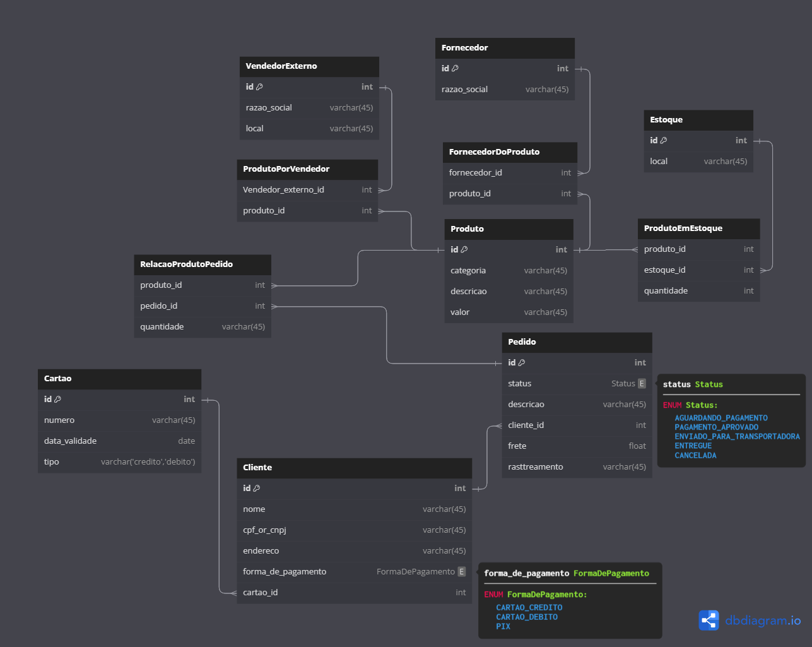

# Projeto Conceitual de Banco de Dados – E-COMMERCE

Este repositório contém a estrutura do banco de dados para um sistema de gerenciamento de vendas online. O sistema permite que os clientes comprem produtos de diversos vendedores terceiros, realizem pagamentos, e acompanhem o status de entrega de seus pedidos.

## Narrativa - Produto

- Os produtos são vendidos por uma única plataforma online. Contudo, estes podem ter vendedores distintos (terceiros).
- Cada produto possui um fornecedor responsável pelo seu cadastro e entrega.
- Um ou mais produtos podem compor um pedido, permitindo que os clientes adquiram diferentes itens em uma única compra.

## Narrativa - Cliente

- O cliente pode se cadastrar no sistema utilizando seu CPF ou CNPJ, mas não pode ter ambas as informações cadastradas.
- O endereço do cliente é utilizado para calcular o valor do frete durante a compra.
- Um cliente pode realizar mais de um pedido e possui um período de carência para a devolução de produtos, seguindo as políticas de troca e devolução da plataforma.

## Narrativa - Pedido

- Os pedidos são criados pelos clientes e contêm informações de compra, endereço de entrega e status de entrega.
- Um pedido pode conter um ou mais produtos selecionados pelo cliente.
- O cliente tem a opção de cancelar o pedido antes da entrega ser efetuada.

## Narrativa - Pagamento

- O sistema permite que os clientes realizem pagamentos de diferentes formas, incluindo cartão de crédito, cartão de débito e PIX.
- Cada pedido pode ter mais de uma forma de pagamento registrada, caso o cliente opte por dividir o valor total entre diferentes meios de pagamento.

## Narrativa - Entrega

- O processo de entrega é rastreado pelo sistema e possui um status atualizado em tempo real.
- Cada entrega é associada a um código de rastreio que permite ao cliente acompanhar o trajeto do pedido até o destino final.

## Diagrama do Banco de Dados

O diagrama do banco de dados correspondente a essa lógica foi criado utilizando o [DBdiagram.io](https://dbdiagram.io/)
