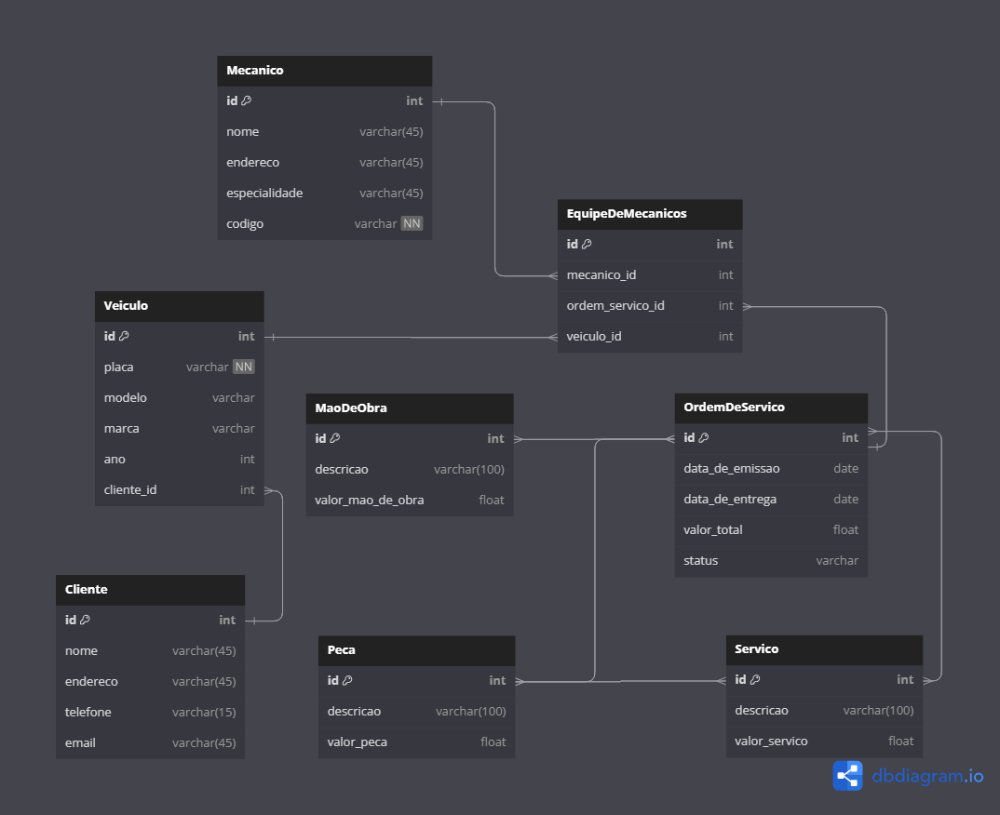

# Sistema de Controle e Gerenciamento de Execução de Ordens de Serviço (OS) em Oficina Mecânica

Este projeto contém a estrutura do banco de dados para um sistema que possa auxiliar no controle e gerenciamento das ordens de serviço em uma oficina mecânicO sistema permite o registro, acompanhamento e execução dos serviços solicitados pelos clientes em seus veículos, garantindo uma gestão eficiente e organizada dos processos.

## Funcionalidades

O sistema oferece as seguintes funcionalidades:

### Cadastro de Clientes:

- Permite o registro dos clientes da oficina, incluindo suas informações de contato.
- Os clientes são essenciais para o correto relacionamento e comunicação com os proprietários dos veículos atendidos.

### Cadastro de Veículos:

- Possibilita o cadastro dos veículos atendidos na oficina.
- Os veículos são associados aos respectivos clientes, permitindo o rastreamento dos históricos de manutenção e serviços realizados.

### Cadastro de Mecânicos:

- Permite o registro dos mecânicos que compõem as equipes de trabalho da oficina.
- Cada mecânico possui informações como código, nome, endereço e especialidade, facilitando o planejamento e alocação de tarefas.

### Cadastro de Peças:

- O sistema possui uma tabela para cadastro de peças utilizadas nos serviços de manutenção.
- Cada peça possui um identificador único (ID), uma descrição e um valor.
- As peças são associadas às ordens de serviço, permitindo o registro das peças utilizadas em cada serviço específico.

### Emissão de Ordens de Serviço (OS):

- A partir das informações fornecidas pelos clientes sobre os serviços desejados para seus veículos, o sistema gera uma Ordem de Serviço com um número único de identificação.
- A OS também inclui a data de emissão, valor estimado, status e data prevista para a conclusão dos trabalhos, fornecendo um controle abrangente sobre as tarefas pendentes.

### Consulta de Tabela de Referência de Mão-de-Obra:

- Para calcular o valor de cada serviço, o sistema possui uma tabela de referência de mão-de-obra.
- Essa tabela auxilia na precificação dos serviços executados e contribui para uma política de preços transparente e justa.

### Autorização dos Serviços:

- Após a elaboração da OS e a consulta à tabela de referência, o cliente é consultado e autoriza a execução dos serviços propostos.
- Esse processo de autorização é importante para garantir que o cliente esteja ciente dos serviços a serem realizados e dos custos envolvidos.

### Acompanhamento da Execução dos Serviços:

- A mesma equipe de mecânicos responsável pelo preenchimento da OS avalia e executa os serviços solicitados.
- O sistema permite o acompanhamento em tempo real do andamento do trabalho e atualizações do status da OS conforme a execução avança.

## Diagrama do Banco de Dados

O diagrama do banco de dados correspondente a essa lógica foi criado utilizando o [DBdiagram.io](https://dbdiagram.io/)
